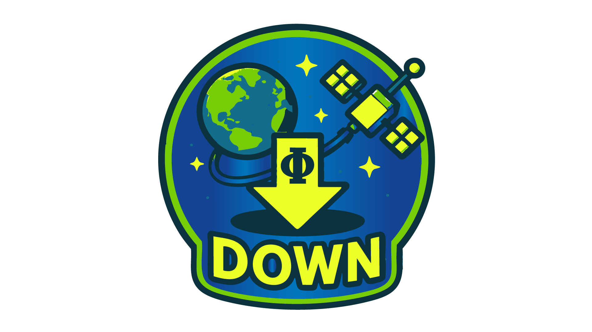
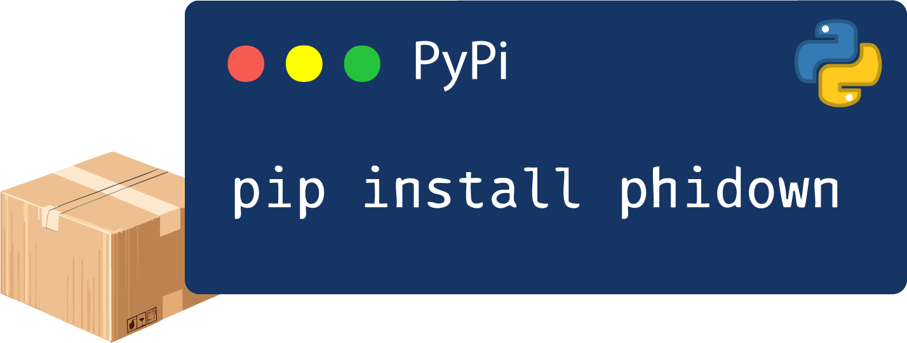

[](https://www.python.org/downloads/)
[](https://github.com/ESA-PhiLab/phidown/wiki)
[](https://makeapullrequest.com)
[](https://doi.org/10.5281/zenodo.15332053)
[](https://www.gnu.org/licenses/gpl-3.0)
<div align="center">


# 🌍 **Φ-Down**: Your Gateway to Copernicus Data

*Effortlessly search and download Earth Observation data with **Φ-Down** - your simple gateway to Copernicus data.*

</div>


<div align="center" style="margin-top: 20px; margin-bottom: 20px;">
  <h3>🌐 Connect with Φ-Lab & the Author</h3>
<div align="center">

  <p style="margin-bottom: 10px;">Follow updates, join discussions, and explore research.</p>
  <a href="https://philab.esa.int" target="_blank" style="text-decoration: none;">
</div>
    
  </a>
  <a href="https://www.linkedin.com/groups/8984375/" target="_blank" style="text-decoration: none;">
    
  </a>
  <a href="https://www.linkedin.com/in/roberto-del-prete-8175a7147/" target="_blank" style="text-decoration: none;">
    
  </a>
  <a href="https://scholar.google.com/citations?user=Dwc8YxwAAAAJ&hl=en" target="_blank" style="text-decoration: none;">
    
  </a>
</div>


## Overview 

**Φ-Down** is a Python library that simplifies accessing Earth Observation data from the Copernicus Data Space Ecosystem using AWS services and dataset tools. It provides a streamlined interface for searching, filtering, and downloading satellite imagery from various Sentinel missions and contributing datasets.

Whether you're a researcher, developer, or data scientist, Φ-Down makes it easy to incorporate satellite data into your workflows without dealing with complex APIs or authentication processes.


| Feature | Description |
|---------|-------------|
|  |  |
|Example Notebook | [](https://colab.research.google.com/drive/1ZLIyKS_OrDmJfW4H5R6i1_b88vqrdCKz?usp=sharing) |
| Python Support | [](https://www.python.org/downloads/) |
| PyPi | [](https://pypi.org/project/phidown/) |
| License | [](https://www.gnu.org/licenses/gpl-3.0) |
| Documentation | [](https://github.com/ESA-PhiLab/phidown/wiki) |
| Contributions | [](https://makeapullrequest.com) |


## Features

- Authenticate with the Copernicus Data Space Ecosystem.
- Search for Sentinel products using the OData API with various filters `_query_by_filter` (collection, product type, date, AOI, cloud cover, etc.).
- Search for products by exact name using `_query_by_name`.
- Download Sentinel products using the S3 protocol. 


Here's a quick example of how to use Φ-Down to search and download Sentinel data:

```python
from phidown.search import CopernicusDataSearcher
# You can modify these parameters as needed

searcher = CopernicusDataSearcher()
# Configure the search parameters
searcher._query_by_filter(
    collection_name='SENTINEL-1',
    product_type='SLC',
    orbit_direction=None,
    cloud_cover_threshold=None,
    aoi_wkt=None,
    start_date='2023-05-03T00:00:00',
    end_date='2024-05-03T04:00:00',
    top=1000,
    attributes={'swathIdentifier': 'S1'} # Swath identifier Stripmap: S1, ..., S6
)

df = searcher.execute_query()
print(f"Number of results: {len(df)}")
# Display the first few rows of the DataFrame
searcher.display_results(top_n=15)
```

For more advanced use cases, including searching with geographical filters and batch downloading, see the [usage notebook](./how_to_start.ipynb).


## Credentials

> Important:
If your credentials are not deleted automatically, you must manually revoke them here:

> 🔗 Manage S3 Credentials: https://eodata-s3keysmanager.dataspace.copernicus.eu/panel/s3-credentials

Stay secure — always clean up your credentials!

##  Supported Missions

The following collections are currently available:

<details>
<summary><strong>Copernicus Sentinel Mission</strong></summary>

- SENTINEL-1
- SENTINEL-2
- SENTINEL-3
- SENTINEL-5P
- SENTINEL-6
- SENTINEL-1-RTC (Sentinel-1 Radiometric Terrain Corrected)

</details>

<details>
<summary><strong>Complementary data</strong></summary>

- GLOBAL-MOSAICS (Sentinel-1 and Sentinel-2 Global Mosaics)
- SMOS (Soil Moisture and Ocean Salinity)
- ENVISAT (ENVISAT- Medium Resolution Imaging Spectrometer - MERIS)
- LANDSAT-5
- LANDSAT-7
- LANDSAT-8
- COP-DEM (Copernicus DEM)
- TERRAAQUA (Terra MODIS and Aqua MODIS)
- S2GLC (S2GLC 2017)

</details>

<details>
<summary><strong>Copernicus Contributing Missions (CCM)</strong></summary>

<h4>1. Historical ESA Missions</h4>
<ul>
  <li><strong>ERS-1 / ERS-2</strong> – Radar and atmospheric data (1991–2011)</li>
  <li><strong>Envisat</strong> – Multispectral and radar data for land, ocean, and atmospheric monitoring (2002–2012)</li>
</ul>

<h4>2. ESA Earth Explorer Missions</h4>
<ul>
  <li><strong>SMOS</strong> – Soil moisture and ocean salinity measurements</li>
  <li><strong>CryoSat-2</strong> – Ice thickness and elevation monitoring</li>
</ul>

<h4>3. European National and Commercial Missions</h4>
<ul>
  <li><strong>SPOT (4/5)</strong> – High-resolution optical imagery</li>
  <li><strong>TerraSAR-X / TanDEM-X</strong> – High-resolution SAR data</li>
  <li><strong>COSMO-SkyMed</strong> – SAR imagery for various applications</li>
  <li><strong>Pléiades</strong> – Very high-resolution optical data</li>
  <li><strong>RapidEye</strong> – Multispectral imagery for vegetation monitoring</li>
  <li><strong>DMC Constellation</strong> – Disaster monitoring with optical imagery</li>
</ul>

<h4>4. International Missions</h4>
<ul>
  <li><strong>Landsat (NASA/USGS)</strong> – Long-term optical data archives</li>
  <li><strong>Radarsat-2 (Canada)</strong> – SAR data for land and marine applications</li>
  <li><strong>GOSAT (Japan)</strong> – Greenhouse gas monitoring</li>
  <li><strong>GHGSat</strong> – High-resolution greenhouse gas measurements</li>
</ul>

<h4>5. Emerging European Missions</h4>
<p>Includes nine under-contract missions to deliver multispectral, hyperspectral, thermal infrared, and atmospheric composition data. These missions will be progressively integrated as part of the Copernicus data offering.</p>
<p><a href="https://dataspace.copernicus.eu/explore-data/data-collections/copernicus-contributing-missions/missions/emerging-contributing-missions">More info</a></p>

</details>

---

## Prerequisites
- Python >= 3.9

---

## Installation

### Option 1: Install from PyPI (Recommended)

<div align="right" style="margin-right: 100px;">
  <a href="https://pypi.org/project/phidown/" target="_blank">
    
  </a>
</div>
<div style="margin-left: 200px;">
  
</div>


You can install it directly using pip:
```bash
pip install phidown
```


<details>
<summary><strong>Build from source</strong></summary>

### Install with PDM (Using Lock File)
We recommend using [PDM](https://pdm.fming.dev/) (Python Dependency Manager) for managing dependencies, especially for development or ensuring exact versions.

#### Step 1: Install PDM
If you don't already have PDM installed, install it via pip:
```bash
pip install pdm
```

#### Step 2: Install Dependencies Using PDM
Clone the repository and install dependencies using the `pdm.lock` file:
```bash
git clone https://github.com/ESA-PhiLab/phidown.git
cd phidown
pdm install
```

#### Step 3: Install All Dependencies (Including Optional)
To install all dependencies, including optional ones for development or specific features:
```bash
pdm install -G :all
```

### Option 3: Build from Source (Using pip)
If you prefer using pip without PDM, you can clone the repository and install directly:
```bash
git clone https://github.com/ESA-PhiLab/phidown.git
cd phidown
pip install .
```
This will install the package and its dependencies as defined in the `pyproject.toml` file.

</details>

---

## Usage

<details>
<summary><strong>Configure Credentials</strong></summary>

To authenticate with the Copernicus Data Space Ecosystem, you need to create a `secret.yml` file containing your credentials. Follow these steps:

1. Create a file named `secret.yml` in the root directory of the project.
2. Add the following content to the file, replacing `your_username` and `your_password` with your actual credentials:

  ```yaml
  # filepath: ./phidown/secret.yml or the current working directory where phidown is launched
  copernicus:
    username: <your_username>
    password: <your_password>
  ```

3. Save the file.

---

> **💡 Alternative: Pass Credentials w CLI**  
>  
> Instead of using a `secret.yml` file, you can pass your credentials directly when running the script. Use the following command:  
>  
> ```bash
> pdm run python phidown/downloader.py --username <your_username> --password <your_password> --eo_product_name <eo_product_name>
> ```  
>  
> Replace `your_username` and `your_password` with your actual credentials.  
> Replace `eo_product_name` with your actual product name you want to download.  
>  
> The script will:  
> 1. Authenticate with the Copernicus Data Space Ecosystem.  
> 2. Search for Sentinel products within the specified AOI and date range.  
> 3. Download the first matching product using S3.  
</details>


### Example Notebook

For a detailed example of how to use **Φ-Down**, refer to the [how_to_start.ipynb](./how_to_start.ipynb) notebook or [](https://colab.research.google.com/drive/1ZLIyKS_OrDmJfW4H5R6i1_b88vqrdCKz?usp=sharing). It provides step-by-step instructions and practical use cases to help you get started quickly.

> **⚠️ Search Optimization Tips⚠️**  
>  
> Crucial for the search performance is specifying the collection name. Example:  
> `Collection/Name eq 'SENTINEL-3'`.  
>  
> An additional efficient way to accelerate the query performance is limiting the query by acquisition dates, e.g.:  
> `ContentDate/Start gt 2022-05-03T00:00:00 and ContentDate/Start lt 2022-05-21T00:00:00`.  
>  
> When searching for products and adding a wide range of dates to the query, e.g., from 2017 to 2023, we recommend splitting the query into individual years, e.g., from January 1, 2023, to December 31, 2023.


## Notes
- **Credentials**: Update your username and password in `phidown/secret.yml`. Do **not** share this file publicly.
- **Virtual Environment**: PDM manages a dedicated virtual environment for the project.
- **Faster Setup**: Using `pdm.lock` improves reproducibility and setup speed.

---

## Troubleshooting
- Ensure you're using Python 3.9 or higher.
- Reinstall dependencies using `pdm install`.
- Check logs and error messages for further insights.
- If credentials are not deleted from the S3 server, you may encounter a 403 error. To resolve this, log in to the Copernicus Data Space Ecosystem, navigate to the S3 Credentials Manager, and manually delete any unused or expired credentials.

---

## Contributing

We welcome contributions to **Φ-Down**! Here's how you can get involved:

1. **Fork the Repository**: Click the "Fork" button at the top of this repository to create your own copy.
2. **Clone Your Fork**: Clone your forked repository to your local machine:
  ```bash
  git clone https://github.com/ESA-PhiLab/phidown.git
  ```
3. **Create a Branch**: Create a new branch for your feature or bug fix:
  ```bash
  git checkout -b feature/your-feature-name
  ```
4. **Make Changes**: Implement your changes and commit them with a descriptive message:
  ```bash
  git commit -m "Add feature: your-feature-name"
  ```
5. **Push Changes**: Push your branch to your forked repository:
  ```bash
  git push origin feature/your-feature-name
  ```
6. **Submit a Pull Request**: Open a pull request to the main repository and describe your changes.

### Guidelines
- Follow the existing code style and structure.
- Write clear and concise commit messages.
- Ensure your code passes all tests and linting checks.
- Update documentation if your changes affect usage.

---

## Community Support

If you encounter any issues or have questions, feel free to open an issue in the repository or join the discussion in the [Discussions](https://github.com/ESA-PhiLab/phidown/discussions) section.

We appreciate your feedback and contributions to make **Φ-Down** even better!

---

## Connect with the Author

Have questions, suggestions, or just want to connect? Reach out to the author:

**Dr. Roberto Del Prete**

[](https://www.linkedin.com/in/roberto-del-prete-8175a7147/)
[](mailto:roberto.delprete@esa.int)
<a href="https://scholar.google.com/citations?user=Dwc8YxwAAAAJ&hl=en" target="_blank" style="text-decoration: none;">
    
  </a>

---

## Citing Φ-Down

If **Φ-Down** has contributed to your research, project, or publication, we kindly ask that you cite it. Your citation helps support the tool's development and recognition within the scientific community! 🙏

**Please use the following citation:**

> Del Prete, R. (2025). *phidown: A Python Tool for Streamlined Data Downloading from CDSE*. Zenodo. doi: 10.5281/zenodo.15332053.

**BibTeX Entry:**

```bibtex
@misc{delprete2025phidown,
  author       = {Del Prete, Roberto},
  title        = {phidown: A Python Tool for Streamlined Data Downloading from CDSE},
  year         = {2025},
  month        = {May},
  publisher    = {Zenodo},
  doi          = {10.5281/zenodo.15332053},
  url          = {https://doi.org/10.5281/zenodo.15332053}
}
```


---
## License

**Φ-Down** is proudly licensed under the **GNU General Public License v3.0 (GPLv3)**.

[](https://www.gnu.org/licenses/gpl-3.0)

This license ensures that the software remains free and open-source, allowing you to:
- **Use** the software freely for any purpose.
- **Share** the software with others.
- **Modify** the software and share your modifications under the same license terms.

For full details, please refer to the [GPLv3 License Text](https://www.gnu.org/licenses/gpl-3.0.en.html).
