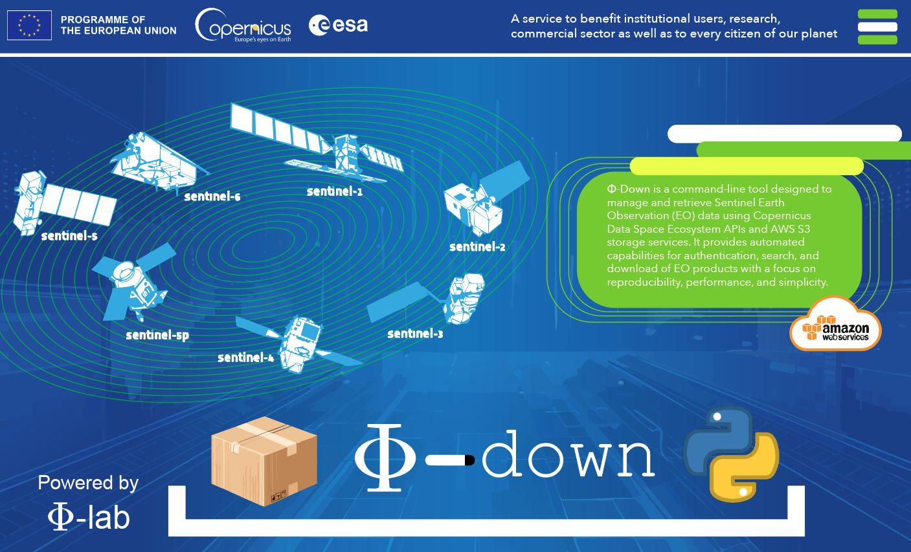

<div align="center">

# 🌍 **Φ-Down**: Your Gateway to Copernicus Data

Effortlessly manage, search, and download Earth Observation data with **Φ-Down**. Unlock the full potential of Copernicus datasets with ease and efficiency.

</div>



#### This repository provides tools for managing Sentinel data using AWS services and dataset tools. It includes functionality for authentication, product search, and downloading Earth Observation (EO) products.


---
## Features

- Authenticate with the Copernicus Data Space Ecosystem.
- Search for Sentinel products using the OData API.
- Download Sentinel products using the S3 protocol. 


## Credentials

> Important:
If your credentials are not deleted automatically, you must manually revoke them here:

> 🔗 Manage S3 Credentials: https://eodata-s3keysmanager.dataspace.copernicus.eu/panel/s3-credentials

Stay secure — always clean up your credentials!

##  Supported Missions

The following collections are currently available:

<details>
<summary><strong>Copernicus Sentinel Mission</strong></summary>

- SENTINEL-1
- SENTINEL-2
- SENTINEL-3
- SENTINEL-5P
- SENTINEL-6
- SENTINEL-1-RTC (Sentinel-1 Radiometric Terrain Corrected)

</details>

<details>
<summary><strong>Complementary data</strong></summary>

- GLOBAL-MOSAICS (Sentinel-1 and Sentinel-2 Global Mosaics)
- SMOS (Soil Moisture and Ocean Salinity)
- ENVISAT (ENVISAT- Medium Resolution Imaging Spectrometer - MERIS)
- LANDSAT-5
- LANDSAT-7
- LANDSAT-8
- COP-DEM (Copernicus DEM)
- TERRAAQUA (Terra MODIS and Aqua MODIS)
- S2GLC (S2GLC 2017)

</details>

<details>
<summary><strong>Copernicus Contributing Missions (CCM)</strong></summary>

<h4>1. Historical ESA Missions</h4>
<ul>
  <li><strong>ERS-1 / ERS-2</strong> – Radar and atmospheric data (1991–2011)</li>
  <li><strong>Envisat</strong> – Multispectral and radar data for land, ocean, and atmospheric monitoring (2002–2012)</li>
</ul>

<h4>2. ESA Earth Explorer Missions</h4>
<ul>
  <li><strong>SMOS</strong> – Soil moisture and ocean salinity measurements</li>
  <li><strong>CryoSat-2</strong> – Ice thickness and elevation monitoring</li>
</ul>

<h4>3. European National and Commercial Missions</h4>
<ul>
  <li><strong>SPOT (4/5)</strong> – High-resolution optical imagery</li>
  <li><strong>TerraSAR-X / TanDEM-X</strong> – High-resolution SAR data</li>
  <li><strong>COSMO-SkyMed</strong> – SAR imagery for various applications</li>
  <li><strong>Pléiades</strong> – Very high-resolution optical data</li>
  <li><strong>RapidEye</strong> – Multispectral imagery for vegetation monitoring</li>
  <li><strong>DMC Constellation</strong> – Disaster monitoring with optical imagery</li>
</ul>

<h4>4. International Missions</h4>
<ul>
  <li><strong>Landsat (NASA/USGS)</strong> – Long-term optical data archives</li>
  <li><strong>Radarsat-2 (Canada)</strong> – SAR data for land and marine applications</li>
  <li><strong>GOSAT (Japan)</strong> – Greenhouse gas monitoring</li>
  <li><strong>GHGSat</strong> – High-resolution greenhouse gas measurements</li>
</ul>

<h4>5. Emerging European Missions</h4>
<p>Includes nine under-contract missions to deliver multispectral, hyperspectral, thermal infrared, and atmospheric composition data. These missions will be progressively integrated as part of the Copernicus data offering.</p>
<p><a href="https://dataspace.copernicus.eu/explore-data/data-collections/copernicus-contributing-missions/missions/emerging-contributing-missions">More info</a></p>

</details>

---

## Prerequisites
- Python 3.9 or higher

---

## Installation

<details>
<summary><strong>Installation Steps</strong></summary>

### Step 1: Install PDM
We will use [PDM](https://pdm.fming.dev/) (Python Dependency Manager) to simplify our life.  
If you don't already have PDM installed, install it via pip:
```bash
pip install pdm
```

### Step 2: Install Dependencies Using PDM
Use the `pdm.lock` file to install exact versions of dependencies:
```bash
pdm add git+https://github.com/ESA-PhiLab/phidown.git
pdm install
```

### Step 2b: Install All Dependencies (Including Optional)
To install all dependencies, including optional ones, run the following command:

```bash
pdm install -G all
```

### Alternative: Build from Source
If you prefer using pip, you can install the dependencies directly:
```bash
git clone https://github.com/ESA-PhiLab/phidown.git & cd phidown
pip install .
```

This will install the package and its dependencies as defined in the `pyproject.toml` file.

</details>

---

## Usage

<details>
<summary><strong>Configure Credentials</strong></summary>

To authenticate with the Copernicus Data Space Ecosystem, you need to create a `secret.yml` file containing your credentials. Follow these steps:

1. Create a file named `secret.yml` in the root directory of the project.
2. Add the following content to the file, replacing `your_username` and `your_password` with your actual credentials:

  ```yaml
  # filepath: ./phidown/secret.yml
  copernicus:
    username: <your_username>
    password: <your_password>
  ```

3. Save the file.

---

> **💡 Alternative: Pass Credentials w CLI**  
>  
> Instead of using a `secret.yml` file, you can pass your credentials directly when running the script. Use the following command:  
>  
> ```bash
> pdm run python phidown/downloader.py --username <your_username> --password <your_password> --eo_product_name <eo_product_name>
> ```  
>  
> Replace `your_username` and `your_password` with your actual credentials.  
> Replace `eo_product_name` with your actual product name you want to download.  
>  
> The script will:  
> 1. Authenticate with the Copernicus Data Space Ecosystem.  
> 2. Search for Sentinel products within the specified AOI and date range.  
> 3. Download the first matching product using S3.  
</details>


### Example Notebook

For a detailed example of how to use **Φ-Down**, refer to the [usage.ipynb](./usage.ipynb) notebook. It provides step-by-step instructions and practical use cases to help you get started quickly.

> **⚠️ Search Optimization Tips⚠️**  
>  
> Crucial for the search performance is specifying the collection name. Example:  
> `Collection/Name eq 'SENTINEL-3'`.  
>  
> An additional efficient way to accelerate the query performance is limiting the query by acquisition dates, e.g.:  
> `ContentDate/Start gt 2022-05-03T00:00:00.000Z and ContentDate/Start lt 2022-05-21T00:00:00.000Z`.  
>  
> When searching for products and adding a wide range of dates to the query, e.g., from 2017 to 2023, we recommend splitting the query into individual years, e.g., from January 1, 2023, to December 31, 2023.


## Notes
- **Credentials**: Update your username and password in `phidown/secret.yml`. Do **not** share this file publicly.
- **Virtual Environment**: PDM manages a dedicated virtual environment for the project.
- **Faster Setup**: Using `pdm.lock` improves reproducibility and setup speed.

---

## Troubleshooting
- Ensure you're using Python 3.8 or higher.
- Reinstall dependencies using `pdm install`.
- Check logs and error messages for further insights.
- If credentials are not deleted from the S3 server, you may encounter a 403 error. To resolve this, log in to the Copernicus Data Space Ecosystem, navigate to the S3 Credentials Manager, and manually delete any unused or expired credentials.

---

## Contributing

We welcome contributions to **Φ-Down**! Here's how you can get involved:

1. **Fork the Repository**: Click the "Fork" button at the top of this repository to create your own copy.
2. **Clone Your Fork**: Clone your forked repository to your local machine:
  ```bash
  git clone https://github.com/your-username/phidown.git
  ```
3. **Create a Branch**: Create a new branch for your feature or bug fix:
  ```bash
  git checkout -b feature/your-feature-name
  ```
4. **Make Changes**: Implement your changes and commit them with a descriptive message:
  ```bash
  git commit -m "Add feature: your-feature-name"
  ```
5. **Push Changes**: Push your branch to your forked repository:
  ```bash
  git push origin feature/your-feature-name
  ```
6. **Submit a Pull Request**: Open a pull request to the main repository and describe your changes.

### Guidelines
- Follow the existing code style and structure.
- Write clear and concise commit messages.
- Ensure your code passes all tests and linting checks.
- Update documentation if your changes affect usage.

---

## Community Support

If you encounter any issues or have questions, feel free to open an issue in the repository or join the discussion in the [Discussions](https://github.com/ESA-PhiLab/phidown/discussions) section.

We appreciate your feedback and contributions to make **Φ-Down** even better!

---

## Contact

**Roberto Del Prete**  
🌐 [LinkedIn](https://www.linkedin.com/in/roberto-del-prete/)  
✉️ roberto.delprete@esa.int

---

## License
This project is licensed under the CC by 2.0 License.