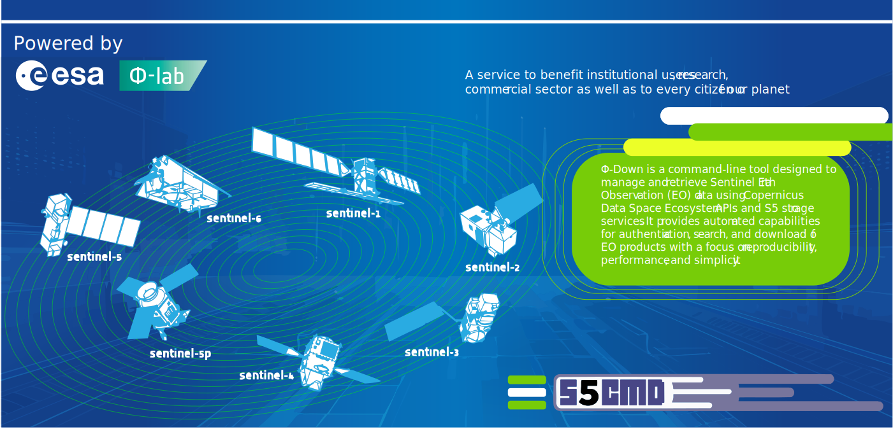

[](https://www.python.org/downloads/)
[](https://esa-philab.github.io/phidown)
[](https://doi.org/10.5281/zenodo.15332053)


#  **Φ-Down**: Your Gateway to Copernicus Data <a href="https://github.com/ESA-PhiLab/phidown"></a>

<div align="center" style="margin: 40px 0;">
  <h3 style="padding-left: 40px; margin-bottom: 20px;">🌐 Connect with Φ-Lab & the Author</h3>

  <div style="display: flex; flex-wrap: wrap; justify-content: center; gap: 10px;">
    <a href="https://philab.esa.int" target="_blank" style="text-decoration: none;">
      
    </a>
    <a href="https://www.linkedin.com/groups/8984375/" target="_blank" style="text-decoration: none;">
      
    </a>
    <a href="https://www.linkedin.com/in/roberto-del-prete-8175a7147/" target="_blank" style="text-decoration: none;">
      
    </a>
    <a href="https://scholar.google.com/citations?user=Dwc8YxwAAAAJ&hl=en" target="_blank" style="text-decoration: none;">
      
    </a>
  </div>
</div>

---

## By Roberto Del Prete

**Φ-Down** is a Python library that simplifies accessing Earth Observation data from the Copernicus Data Space Ecosystem using services and dataset tools. It provides a streamlined interface for searching, filtering, and downloading satellite imagery from various Sentinel missions and contributing datasets.

Whether you're a researcher, developer, or data scientist, Φ-Down makes it easy to incorporate satellite data into your workflows without dealing with complex APIs or authentication processes.


| Feature | Description |
|---------|-------------|
|Example Notebook | [](https://colab.research.google.com/drive/1ZLIyKS_OrDmJfW4H5R6i1_b88vqrdCKz?usp=sharing) |
| Python Support | [](https://www.python.org/downloads/) |
| PyPi | [](https://pypi.org/project/phidown/) |
| License | [](https://www.apache.org/licenses/LICENSE-2.0) |
| Documentation | [](https://esa-philab.github.io/phidown) |
| Contributions | [](https://makeapullrequest.com) |


> ## 🚀 **What's Next & Feature Status**
> 
> - ✔️ **Done:** Add a progress bar.  
> - ✔️ **Done:** Sentinel-1 SLC Burst Mode support (v0.1.20)
> - [x] **Coming soon:** Implement a `count` option for search results more than 1000
> - [x] **Coming soon:** Add a parallel download executor
> - [x] **Coming soon:** Improve docs for ALL missions.


## Features

- 🔐 Authenticate with the Copernicus Data Space Ecosystem.
- 🔍 Search for Sentinel products using the OData API with various filters `query_by_filter` (collection, product type, date, AOI, cloud cover, etc.).
- 🆔 Search for products by exact name using `query_by_name`.
- 📥 Download Sentinel products using the S3 protocol.
- 🎯 **NEW:** Search individual Sentinel-1 SLC bursts (burst mode) for efficient InSAR analysis.
- 🗺️ Interactive polygon selection tools for area of interest definition.
- 📊 Built-in visualization and result analysis capabilities. 


Here's a quick example of how to use Φ-Down to search and download Sentinel data:

```python
from phidown.search import CopernicusDataSearcher
# You can modify these parameters as needed

searcher = CopernicusDataSearcher()
# Configure the search parameters
searcher.query_by_filter(
    collection_name='SENTINEL-1',
    product_type='SLC',
    orbit_direction=None,
    cloud_cover_threshold=None,
    aoi_wkt=None,
    start_date='2023-05-03T00:00:00',
    end_date='2024-05-03T04:00:00',
    top=1000,
    attributes={'swathIdentifier': 'S1'} # Swath identifier Stripmap: S1, ..., S6
)

df = searcher.execute_query()
print(f"Number of results: {len(df)}")
# Display the first few rows of the DataFrame
searcher.display_results(top_n=15)
```

### Sentinel-1 SLC Burst Mode (New in v0.1.20)

Search for individual Sentinel-1 SLC bursts for efficient InSAR analysis:

```python
from phidown.search import CopernicusDataSearcher

searcher = CopernicusDataSearcher()

# Search for bursts with specific parameters
searcher.query_by_filter(
    burst_mode=True,  # Enable burst mode
    burst_id=15804,   # Specific burst ID
    swath_identifier='IW2',
    polarisation_channels='VV',
    orbit_direction='DESCENDING',
    start_date='2024-08-01T00:00:00',
    end_date='2024-08-15T00:00:00',
    top=20,
    count=True
)

df = searcher.execute_query()
print(f"Found {len(df)} bursts")
print(f"Total available: {searcher.num_results}")
searcher.display_results(top_n=5)
```

For more advanced use cases, including searching with geographical filters and batch downloading, see the [usage notebook](./how_to_start.ipynb) and the [burst mode examples notebook](./notebooks/6_burst_search_examples.ipynb).

## 🖥️ Command-Line Interface (CLI)

**NEW in v0.1.23:** Φ-Down now includes a powerful CLI for downloading products directly from your terminal!

### Quick Start

After installation, you can use the `phidown` command to download products:

```bash
# Download by product name
phidown --name S1A_IW_GRDH_1SDV_20240503T031926_20240503T031942_053701_0685FB_E003 -o ./data

# Download by S3 path
phidown --s3path /eodata/Sentinel-1/SAR/IW_GRDH_1S/2024/05/03/... -o ./data

# Reset configuration and enter new credentials
phidown --name PRODUCT_NAME -o ./data --reset

# Download without progress bar
phidown --name PRODUCT_NAME -o ./data --no-progress
```

### CLI Options

```
phidown --help

options:
  -h, --help            show this help message and exit
  --name NAME           Product name to download
  --s3path S3PATH       S3 path to download (must start with /eodata/)
  -o OUTPUT_DIR, --output-dir OUTPUT_DIR
                        Output directory for downloaded data (default: current directory)
  -c CONFIG_FILE, --config-file CONFIG_FILE
                        Path to s5cmd configuration file (default: .s5cfg)
  --reset               Reset configuration file and prompt for new credentials
  --no-progress         Disable progress bar during download
  --no-download-all     Download specific file instead of entire directory (for S3 path only)
  -v, --verbose         Enable verbose output
  --version             show program's version number and exit
```

### CLI Examples

**1. Simple download with automatic credentials setup:**
```bash
# First time - will prompt for credentials
phidown --name S1A_IW_GRDH_1SDV_20240503T031926 -o ~/downloads
```

**2. Download to specific directory:**
```bash
phidown --name S2A_MSIL2A_20240503T101031_N0510 -o /data/sentinel2
```

**3. Download using S3 path:**
```bash
phidown --s3path /eodata/Sentinel-1/SAR/IW_RAW__0S/2024/05/03/S1A_IW_RAW__0SDV.SAFE -o ./raw_data
```

**4. Use custom config file:**
```bash
phidown --name PRODUCT_NAME -o ./data -c ~/.my-s5cfg
```

### Python API

You can also use the CLI functions programmatically in your Python code:

```python
from phidown import download_by_name, download_by_s3path

# Download by product name
success = download_by_name(
    product_name='S1A_IW_GRDH_1SDV_20240503T031926_20240503T031942_053701_0685FB_E003',
    output_dir='./downloads',
    show_progress=True
)

# Download by S3 path
success = download_by_s3path(
    s3_path='/eodata/Sentinel-1/SAR/IW_GRDH_1S/2024/05/03/...',
    output_dir='./downloads',
    download_all=True
)
```

## � Download Progress Monitoring

When using `pull_down()` to download data, Φ-Down now streams s5cmd output in real time so you can monitor download progress:

- **Live Progress**: File transfer messages appear as they happen (no more waiting for completion to see what happened)
- **No Setup Required**: Progress streaming is enabled by default - no environment variables needed
- **Prerequisites**: Ensure `s5cmd` is installed and available on your PATH

Example output during download:
```
INFO:phidown.s5cmd_utils:Running command: s5cmd --endpoint-url https://eodata.dataspace.copernicus.eu cp s3:/eodata/Sentinel-1/...
INFO:phidown.s5cmd_utils:Downloading from: s3:/eodata/Sentinel-1/SAR/...
INFO:phidown.s5cmd_utils:Output directory: /path/to/output/
INFO:phidown.s5cmd_utils:cp s3:/eodata/.../file1.tiff ./output/
INFO:phidown.s5cmd_utils:cp s3:/eodata/.../file2.xml ./output/
INFO:phidown.s5cmd_utils:✓ Download completed
```

## �📚 Documentation

Comprehensive documentation is available at: **[https://esa-philab.github.io/phidown](https://esa-philab.github.io/phidown)**

- **[Getting Started](https://esa-philab.github.io/phidown/getting_started.html)** - Quick start guide
- **[Installation](https://esa-philab.github.io/phidown/installation.html)** - Detailed installation instructions
- **[User Guide](https://esa-philab.github.io/phidown/user_guide.html)** - Complete usage guide
- **[Sentinel-1 Burst Mode](https://esa-philab.github.io/phidown/sentinel1_burst_mode.html)** - NEW: Individual burst search guide
- **[API Reference](https://esa-philab.github.io/phidown/api_reference.html)** - Full API documentation
- **[Examples](https://esa-philab.github.io/phidown/examples.html)** - Code examples and tutorials
- **[Contributing](https://esa-philab.github.io/phidown/contributing.html)** - How to contribute


## Credentials

> Important:
If your credentials are not deleted automatically, you must manually revoke them here:

> 🔗 Manage S3 Credentials: https://eodata-s3keysmanager.dataspace.copernicus.eu/panel/s3-credentials

Stay secure — always clean up your credentials!

##  Supported Missions

The following collections are currently available:

<details>
<summary><strong>Copernicus Sentinel Mission</strong></summary>

- SENTINEL-1
- SENTINEL-2
- SENTINEL-3
- SENTINEL-5P
- SENTINEL-6
- SENTINEL-1-RTC (Sentinel-1 Radiometric Terrain Corrected)

</details>

<details>
<summary><strong>Complementary data</strong></summary>

- GLOBAL-MOSAICS (Sentinel-1 and Sentinel-2 Global Mosaics)
- SMOS (Soil Moisture and Ocean Salinity)
- ENVISAT (ENVISAT- Medium Resolution Imaging Spectrometer - MERIS)
- LANDSAT-5
- LANDSAT-7
- LANDSAT-8
- COP-DEM (Copernicus DEM)
- TERRAAQUA (Terra MODIS and Aqua MODIS)
- S2GLC (S2GLC 2017)

</details>

<details>
<summary><strong>Copernicus Contributing Missions (CCM)</strong></summary>

<h4>1. Historical ESA Missions</h4>
<ul>
  <li><strong>ERS-1 / ERS-2</strong> – Radar and atmospheric data (1991–2011)</li>
  <li><strong>Envisat</strong> – Multispectral and radar data for land, ocean, and atmospheric monitoring (2002–2012)</li>
</ul>

<h4>2. ESA Earth Explorer Missions</h4>
<ul>
  <li><strong>SMOS</strong> – Soil moisture and ocean salinity measurements</li>
  <li><strong>CryoSat-2</strong> – Ice thickness and elevation monitoring</li>
</ul>

<h4>3. European National and Commercial Missions</h4>
<ul>
  <li><strong>SPOT (4/5)</strong> – High-resolution optical imagery</li>
  <li><strong>TerraSAR-X / TanDEM-X</strong> – High-resolution SAR data</li>
  <li><strong>COSMO-SkyMed</strong> – SAR imagery for various applications</li>
  <li><strong>Pléiades</strong> – Very high-resolution optical data</li>
  <li><strong>RapidEye</strong> – Multispectral imagery for vegetation monitoring</li>
  <li><strong>DMC Constellation</strong> – Disaster monitoring with optical imagery</li>
</ul>

<h4>4. International Missions</h4>
<ul>
  <li><strong>Landsat (NASA/USGS)</strong> – Long-term optical data archives</li>
  <li><strong>Radarsat-2 (Canada)</strong> – SAR data for land and marine applications</li>
  <li><strong>GOSAT (Japan)</strong> – Greenhouse gas monitoring</li>
  <li><strong>GHGSat</strong> – High-resolution greenhouse gas measurements</li>
</ul>

<h4>5. Emerging European Missions</h4>
<p>Includes nine under-contract missions to deliver multispectral, hyperspectral, thermal infrared, and atmospheric composition data. These missions will be progressively integrated as part of the Copernicus data offering.</p>
<p><a href="https://dataspace.copernicus.eu/explore-data/data-collections/copernicus-contributing-missions/missions/emerging-contributing-missions">More info</a></p>

</details>

---

## Prerequisites
- Python >= 3.9

---

## Installation

### Option 1: Install from PyPI (Recommended)

<div align="right" style="margin-right: 100px;">
  <a href="https://pypi.org/project/phidown/" target="_blank">
    
  </a>
</div>
<div style="margin-left: 200px;">
  
</div>

#### Basic Installation

You can install the core package directly using pip:

```bash
pip install phidown
```

#### Installation with Optional Features

Φ-Down comes with several optional dependency groups that enable additional functionality:

**Install with visualization tools:**

```bash
pip install phidown[viz]
```

Includes: `ipywidgets`, `folium` for interactive maps and widgets

**Install with AIS (vessel tracking) support:**

```bash
pip install phidown[ais]
```

Includes: `shapely` for geometric operations

**Install with development tools:**

```bash
pip install phidown[dev]
```

Includes: `pytest`, `pytest-mock`, `flake8` for testing and code quality

**Install with documentation tools:**

```bash
pip install phidown[docs]
```

Includes: `sphinx`, `sphinx-rtd-theme`, and other documentation dependencies

**Install everything (all optional features):**

```bash
pip install phidown[ais,viz,dev,docs]
```

> **💡 Tip:** For most users, we recommend installing with visualization support for the best experience:
> 
> ```bash
> pip install phidown[viz]
> ```


<details>
<summary><strong>Build from source</strong></summary>

### Install with PDM (Using Lock File)
We recommend using [PDM](https://pdm.fming.dev/) (Python Dependency Manager) for managing dependencies, especially for development or ensuring exact versions.

#### Step 1: Install PDM
If you don't already have PDM installed, install it via pip:
```bash
pip install pdm
```

#### Step 2: Install Dependencies Using PDM
Clone the repository and install dependencies using the `pdm.lock` file:
```bash
git clone https://github.com/ESA-PhiLab/phidown.git
cd phidown
pdm install
```

#### Step 3: Install All Dependencies (Including Optional)

To install all dependencies, including optional ones for development or specific features:

```bash
pdm install --group :all
```

Or install specific optional groups:

```bash
# Install with visualization support
pdm install --group viz

# Install with AIS support  
pdm install --group ais

# Install with development tools
pdm install --group dev

# Install with documentation tools
pdm install --group docs

# Install multiple groups
pdm install --group viz --group ais --group dev
```

### Option 3: Build from Source (Using pip)
If you prefer using pip without PDM, you can clone the repository and install directly:
```bash
git clone https://github.com/ESA-PhiLab/phidown.git
cd phidown
pip install .
```
This will install the package and its dependencies as defined in the `pyproject.toml` file.

</details>

---

## Usage

<details>
<summary><strong>Configure Credentials</strong></summary>

To authenticate with the Copernicus Data Space Ecosystem, you need to create a `.s5cfg` file containing your credentials. 

Log to https://eodata-s3keysmanager.dataspace.copernicus.eu/panel/s3-credentials, create your keys them follow these steps:

1. Create a file named `.s5cfg` in the root directory of the project.
2. Add the following content to the file, replacing `aws_access_key_id` and `aws_secret_access_key` with your actual credentials:

  ```yaml
  # filepath: the current working directory where phidown is launched
  [default]
  aws_access_key_id = your_access_key
  aws_secret_access_key = access_key_secret
  aws_region = eu-central-1
  host_base = eodata.dataspace.copernicus.eu
  host_bucket = eodata.dataspace.copernicus.eu
  use_https = true
  check_ssl_certificate = true
  ```

3. Save the file.

---

> **💡 Alternative: Pass Credentials w CLI**  
>  
> Instead of using a `.s5cfg` file, you can pass your S3 credentials directly when running the script. Use the following command:  
>  
> ```bash
> pdm run python phidown/downloader.py --username <your_username> --password <your_password> --eo_product_name <eo_product_name>
> ```  
>  
> Replace `your_username` and `your_password` with your actual S3 credentials.  
> Replace `eo_product_name` with your actual product name you want to download.  
>  
> The script will:  
> 1. Authenticate with the Copernicus Data Space Ecosystem using S3 credentials.  
> 2. Search for Sentinel products within the specified AOI and date range.  
> 3. Download the first matching product using S3.  
</details>


### Example Notebooks

For detailed examples of how to use **Φ-Down**, refer to:
- **[how_to_start.ipynb](./how_to_start.ipynb)** - Basic introduction  [](https://colab.research.google.com/drive/1ZLIyKS_OrDmJfW4H5R6i1_b88vqrdCKz?usp=sharing)
- **[Maritime Monitoring](./notebooks/)** - SAR imagery + AIS vessel tracking integration
- **[Interactive Tools](./notebooks/)** - Map-based area selection and multi-sensor analysis

All notebooks provide step-by-step instructions and practical use cases. See the [notebooks directory](./notebooks/) for the complete collection.

> **⚠️ Search Optimization Tips⚠️**  
>  
> Crucial for the search performance is specifying the collection name. Example:  
> `Collection/Name eq 'SENTINEL-3'`.  
>  
> An additional efficient way to accelerate the query performance is limiting the query by acquisition dates, e.g.:  
> `ContentDate/Start gt 2022-05-03T00:00:00 and ContentDate/Start lt 2022-05-21T00:00:00`.  
>  
> When searching for products and adding a wide range of dates to the query, e.g., from 2017 to 2023, we recommend splitting the query into individual years, e.g., from January 1, 2023, to December 31, 2023.


## Notes
- **Credentials**: S3 credentials are required and must be configured in the `.s5cfg` file. Do **not** share this file publicly.
- **Virtual Environment**: PDM manages a dedicated virtual environment for the project.
- **Faster Setup**: Using `pdm.lock` improves reproducibility and setup speed.

---

## Troubleshooting
- Ensure you're using Python 3.9 or higher.
- Reinstall dependencies using `pdm install`.
- Check logs and error messages for further insights.
- If credentials are not deleted from the S3 server, you may encounter a 403 error. To resolve this, log in to the Copernicus Data Space Ecosystem, navigate to the S3 Credentials Manager, and manually delete any unused or expired credentials.

---

## Contributing

We welcome contributions to **Φ-Down**! Here's how you can get involved:

1. **Fork the Repository**: Click the "Fork" button at the top of this repository to create your own copy.
2. **Clone Your Fork**: Clone your forked repository to your local machine:
  ```bash
  git clone https://github.com/ESA-PhiLab/phidown.git
  ```
3. **Create a Branch**: Create a new branch for your feature or bug fix:
  ```bash
  git checkout -b feature/your-feature-name
  ```
4. **Make Changes**: Implement your changes and commit them with a descriptive message:
  ```bash
  git commit -m "Add feature: your-feature-name"
  ```
5. **Push Changes**: Push your branch to your forked repository:
  ```bash
  git push origin feature/your-feature-name
  ```
6. **Submit a Pull Request**: Open a pull request to the main repository and describe your changes.

### Guidelines
- Follow the existing code style and structure.
- Write clear and concise commit messages.
- Ensure your code passes all tests and linting checks.
- Update documentation if your changes affect usage.

---

## Community Support

If you encounter any issues or have questions, feel free to open an issue in the repository or join the discussion in the [Discussions](https://github.com/ESA-PhiLab/phidown/discussions) section.

We appreciate your feedback and contributions to make **Φ-Down** even better!

---

## Connect with the Author

Have questions, suggestions, or just want to connect? Reach out to the author:

**Dr. Roberto Del Prete**

[](https://www.linkedin.com/in/roberto-del-prete-8175a7147/)
[](mailto:roberto.delprete@esa.int)
<a href="https://scholar.google.com/citations?user=Dwc8YxwAAAAJ&hl=en" target="_blank" style="text-decoration: none;">
    
  </a>

---

## Citing Φ-Down

If **Φ-Down** has contributed to your research, project, or publication, we kindly ask that you cite it. Your citation helps support the tool's development and recognition within the scientific community! 🙏

**Please use the following citation:**

> Del Prete, R. (2025). *phidown: A Python Tool for Streamlined Data Downloading from CDSE*. Zenodo. doi: 10.5281/zenodo.15332053.

**BibTeX Entry:**

```bibtex
@misc{delprete2025phidown,
  author       = {Del Prete, Roberto},
  title        = {phidown: A Python Tool for Streamlined Data Downloading from CDSE},
  year         = {2025},
  month        = {May},
  publisher    = {Zenodo},
  doi          = {10.5281/zenodo.15332053},
  url          = {https://doi.org/10.5281/zenodo.15332053}
}
```


---
## License

**Φ-Down** is proudly licensed under the **Apache License 2.0**.

[](https://www.apache.org/licenses/LICENSE-2.0)

This license lets you:
- **Use** the software freely for commercial and non-commercial purposes.
- **Modify** and distribute the software, provided you include a copy of the license and state any notable changes.
- **Include** any accompanying NOTICE information when redistributing derivative works.

For full details, please refer to the [Apache License 2.0 text](https://www.apache.org/licenses/LICENSE-2.0).
